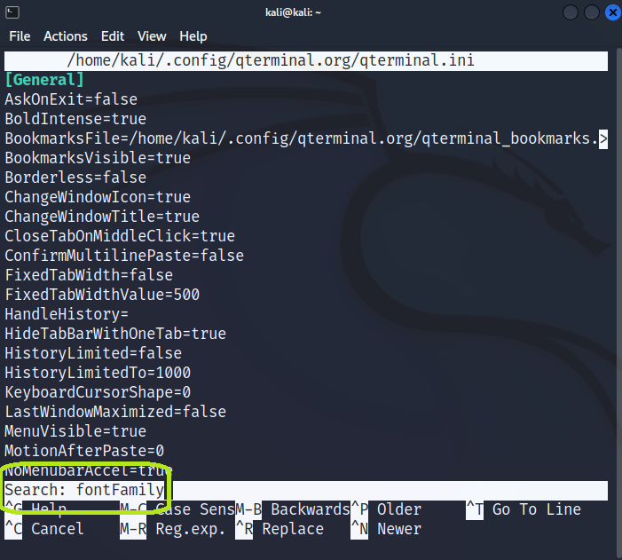

# FontStyleBug

Recently, I ran into a bug in Kali Linux. The bug was that I couldn't change the font in the terminal  
Wonder how i fixed that? Let me show you!

# Tutorial

First we need to find your Kali's username.

To do so, open up terminal and type ***ID***

Username is on your UID but we need word not an number. In my case it's "kali" yours can be different, that's why we checking it :).

Alright, sice we have your username now we can navigate to actual config file where we'll change your font.

In terminal type ***"editor" /home/"username"/.config/qterminal.org/qterminal.ini***  
Replacing **"editor"** with your text editor. *On Kali you can use one of preinstalled for example: **"mousepad"**, **"nano"** or  **"vim"** (I'll be using nano),*
and **"username"** with the useranme we've just found.

NOTE: When typing password in Kali it won't apper as you doing it!

It should look like this

Now click ******CTRL + W***, search bar will appear.
In here type ***"fontFamily"*** and click ETNER.

You'll be navigated to line where we wanna make changes to.

If you wanna changes your font style, you need to change ***"fontFamily"*** parameter. 
To do so delete font name in this case it's ***"FiraCode"***, by navigating with your keys (arrows or shortcuts)

Now in this blank space type font name that you want to change to.
You can find names of fonts open up new Terminal > Right click > Preferences > Apperance > On the top right site click Change

You will see list of Fonts name (I can't make screenshot of it), pick which one you want and go back to your **config file**.

Remember to type font name without any spaces!

I've picked **Fira Code** (which is default), so I'll type **"FiraCode"**. 

You can edit lots of thing here e.x. below you can edit **"fontSize"** parameter.

After change font name, click ***CTRL + S*** to save file and ***CTRL + X*** to exit.

Voilà! 

Now your font style should be changed!

<h1>Thank you for reading and hope it helps!</h1>
  Contact: mathoos264@gmail.com
  
